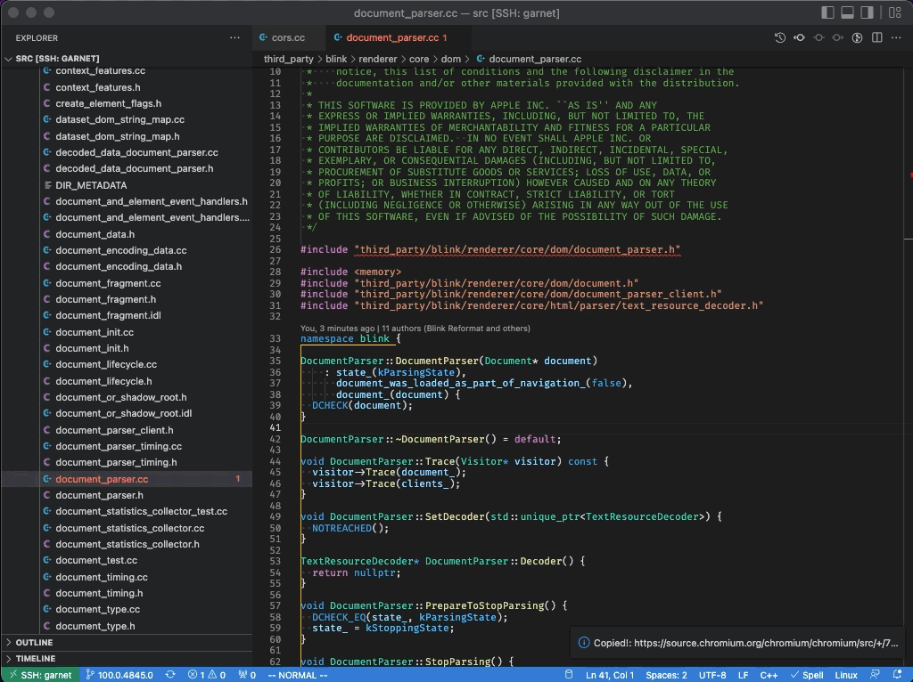

# Copy Chromium Code Search Permalink

This extension enables you to copy permalink of Chromium Code Search.

The example image is as below.

## Install

The extension is available <a href="https://marketplace.visualstudio.com/items?itemName=negibokken.chromium-code-search-permalink">here</a>!

## Supported platform

Currently I confirmed that this extension worked on macOS and Linux.

When you can confirm that this extension work on Windows or other platforms, I'm happy if you let [me](https://twitter.com/negibokken) know that :)

## Issue

[GitHub issue](https://github.com/negibokken/chromium-code-search-permalink-vscode-extension/issues)

## LICENSE

MIT
